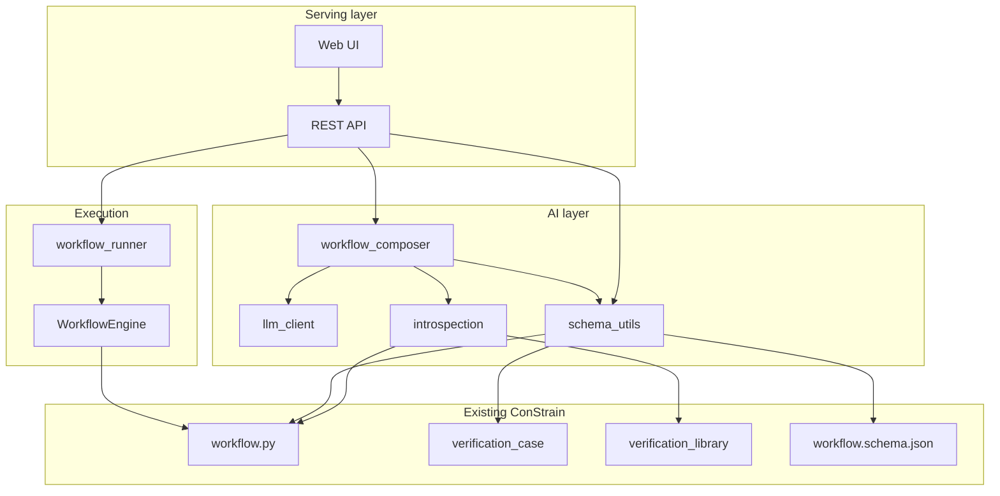
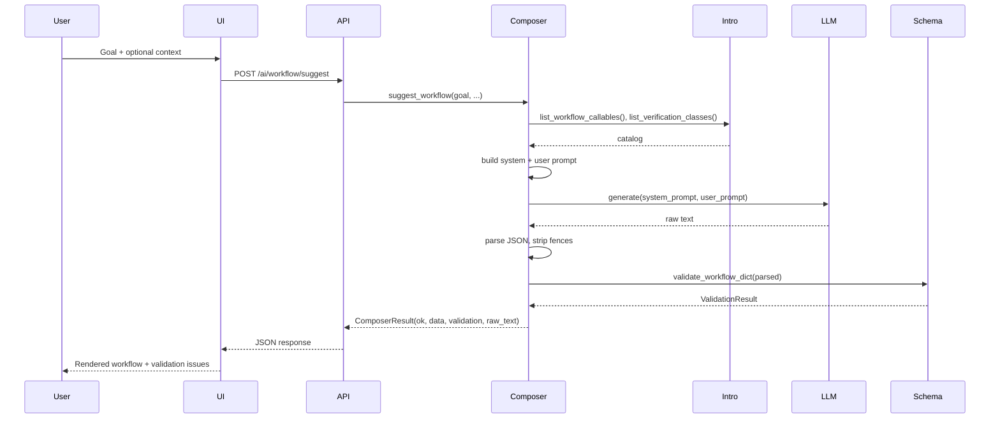
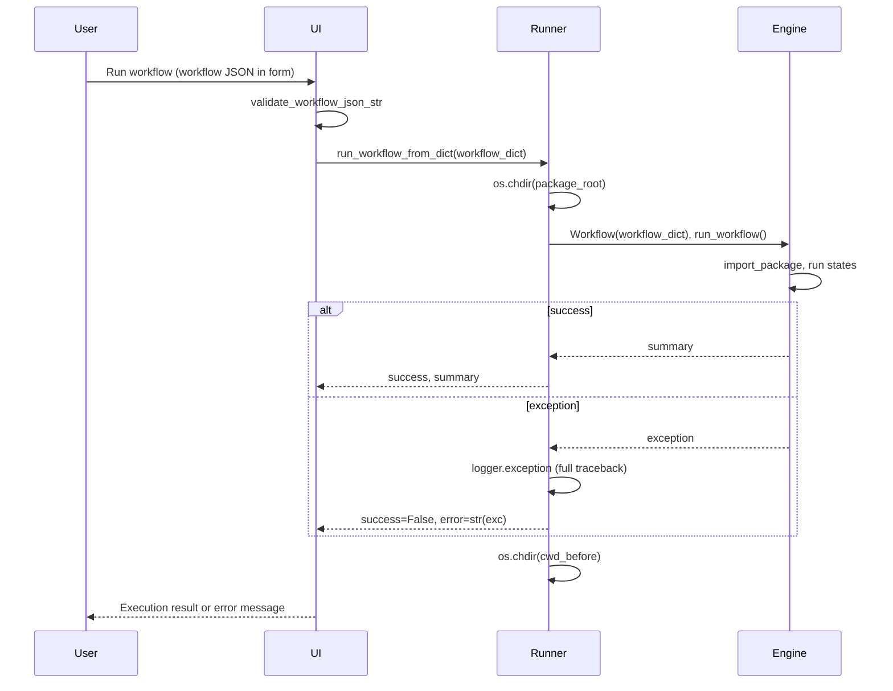

# AI Workflow Composer – Design and Structure

This document describes the design, architecture, and structure of the AI-assisted workflow composer added to ConStrain. It is intended for developers and integrators who need to understand how the system works and how to extend it.

---

## 1. Use case and scope

### 1.1 Problem

ConStrain workflows and verification-case suites are defined in JSON. Authoring them by hand is tedious and error-prone: users must know the schema, the available API callables, and the verification library. Mistakes lead to validation failures or runtime errors.

### 1.2 Solution

An **AI workflow composer** lets users describe their verification goals in natural language. The system:

- Proposes **workflow JSON** (states, MethodCalls, Choices, Payloads) consistent with the ConStrain schema and API.
- Proposes **verification-case JSON** (cases with `verification_class`, `datapoints_source`, etc.) aligned with the verification library.
- Validates both against existing schemas and Python validators.
- Optionally **runs** the generated workflow so users can iterate quickly.

### 1.3 Scope

| In scope | Out of scope |
|----------|--------------|
| Suggest workflow and verification-case JSON from a goal | Editing individual states via natural language (future) |
| Validate workflow and case JSON (schema + Python) | Executing workflows in a sandbox or separate process |
| Run workflow from UI or REST API with fixed cwd | Multi-tenant or authenticated API |
| Provider-agnostic LLM (env-configured) | Built-in model hosting |
| Catalog of callables and verification classes for prompting | Custom DSL or visual workflow editor |

---

## 2. High-level architecture

The implementation is split into: **AI layer** (LLM, composer, validation, introspection), **runner** (execute workflow with correct cwd and error logging), and **serving** (REST API and web UI).



---

## 3. Component structure

### 3.1 Package layout

```
constrain/
  ai/
    __init__.py          # Exposes LLMClient, get_default_llm_client
    llm_client.py        # LLM abstraction and HTTP client
    schema_utils.py      # Workflow and case validation
    introspection.py     # Catalog of callables and verification classes
    workflow_composer.py # suggest_workflow, suggest_verification_cases
    workflow_runner.py  # run_workflow_from_dict, run_workflow_from_files
  api/
    workflow.py          # WorkflowEngine, import_package (extended)
  app/
    ai_workflow_server.py  # FastAPI REST endpoints
    ai_workflow_ui.py      # FastAPI UI app
    templates/
      ai_workflow_index.html
```

### 3.2 Data flow for “suggest workflow”



### 3.3 Data flow for “run workflow”



---

## 4. Design decisions

### 4.1 LLM abstraction

- **Why:** Support multiple providers (OpenAI, local, other) without changing composer or API code.
- **How:** `LLMClient` interface with `generate(system_prompt, user_prompt, ...)`. Default implementation `HTTPJSONLLMClient` talks to an OpenAI-compatible `/chat/completions` endpoint. Configuration via environment variables.

### 4.2 Schema-backed validation

- **Why:** LLM output can be invalid or incomplete; users need clear feedback.
- **How:** Every suggested workflow is validated with `workflow.schema.json` (jsonschema) and `Workflow.validate_workflow_definition`. Every suggested case suite is validated with `VerificationCase.validate_verification_case_structure` per case. Results are returned as `ValidationResult` (valid flag + list of issues with loc, message, validator).

### 4.3 Introspection catalog

- **Why:** The LLM must only suggest callables and verification classes that exist and are executable.
- **How:** `list_workflow_callables()` uses `inspect` on DataProcessing, VerificationCase, Verification, Reporting. `list_verification_classes()` loads the verification library JSON and filters to items present in `globals()` (implemented Python classes). Catalog is serialized and injected into system prompts.

### 4.4 Execution working directory

- **Why:** Workflow JSON uses relative paths (e.g. `./demo/G36_demo/data/...`). The server process cwd is often the repo root, so paths would resolve incorrectly.
- **How:** `workflow_runner` sets `_PACKAGE_ROOT` to the `constrain/` directory. Before creating and running a `Workflow`, it does `os.chdir(_PACKAGE_ROOT)` and restores the previous cwd in a `finally` block. Paths in the workflow are thus relative to the package root, matching the official demo runner.

### 4.5 Import handling in workflow engine

- **Why:** AI-generated workflows sometimes put full statements (e.g. `"import pandas as pd"` or `"from constrain.api... import X"`) in the `imports` array. The engine originally did `exec(f"import {line}", globals())`, causing syntax errors.
- **How:** In `import_package()`: (1) skip lines starting with `"from constrain."` or `"import constrain."` (already imported at top of workflow.py); (2) if line starts with `"from "`, exec as-is; (3) otherwise strip leading `"import "` if present, then exec `f"import {_line}"`.

### 4.6 Error logging on execution failure

- **Why:** The UI only shows a short error message; debugging requires the full traceback.
- **How:** In `workflow_runner`, on exception we call `logger.exception(...)` before returning `WorkflowExecutionResult(success=False, error=str(exc))`. The backend (e.g. uvicorn) log shows the full stack.

---

## 5. API contract summary

### 5.1 REST API (ai_workflow_server)

| Method | Path | Purpose |
|--------|------|---------|
| POST | /ai/workflow/suggest | Suggest workflow JSON from goal + optional context |
| POST | /ai/cases/suggest | Suggest verification-case JSON from goal + optional context |
| POST | /ai/workflow/validate | Validate workflow dict; return issues |
| POST | /ai/cases/validate | Validate case suite dict; return issues |
| GET | /ai/catalog | Return callables and verification classes for client use |
| POST | /ai/workflow/execute | Validate then run workflow; 400 if invalid, 200 with execution result |

### 5.2 Web UI (ai_workflow_ui)

| Method | Path | Purpose |
|--------|------|---------|
| GET | / | Render form and empty proposal panels |
| POST | /compose | Generate workflow + cases from form; re-render with JSON and validation |
| POST | /run | Run workflow from form JSON; re-render with execution summary or error |

### 5.3 Request/response shapes

- **WorkflowSuggestRequest:** `goal_description`, optional `data_context`, `existing_workflow`, `cases_context`.
- **Composer response:** `ok`, `workflow` or `cases`, `validation` (valid + issues), `raw_text`.
- **ExecuteWorkflowRequest:** `workflow`, optional `save_path`.
- **Execute response:** `success`, `validation`, `execution` (saved_to, summary, error).

---

## 6. Dependencies

- **Existing:** `jsonschema`, ConStrain API (workflow, verification_case, verification_library, etc.).
- **Added (pyproject.toml):** `fastapi`, `uvicorn`, `jinja2`, `python-multipart`.
- **LLM:** No hard dependency; configured via env. Any OpenAI-compatible HTTP endpoint works.

---

## 7. Extension points

- **Custom LLM client:** Implement `LLMClient` and pass it into `suggest_workflow` / `suggest_verification_cases` (or wire via dependency injection in the API).
- **More validation:** Extend `schema_utils` (e.g. graph-level checks: unreachable states, single End).
- **Richer prompts:** Change `_build_workflow_system_prompt` / `_build_cases_system_prompt` in `workflow_composer` (e.g. add few-shot examples or stricter instructions).
- **Run in subprocess:** Replace direct `Workflow(...).run_workflow()` in `workflow_runner` with a subprocess that runs the same and streams logs.
