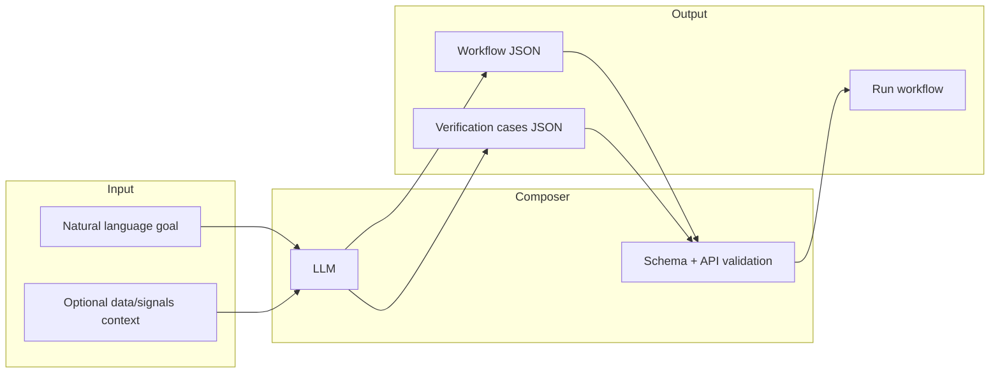
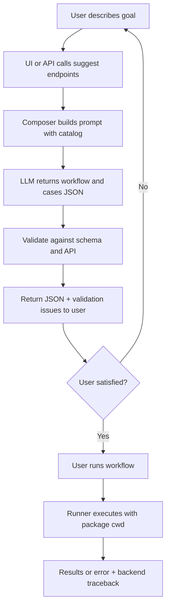
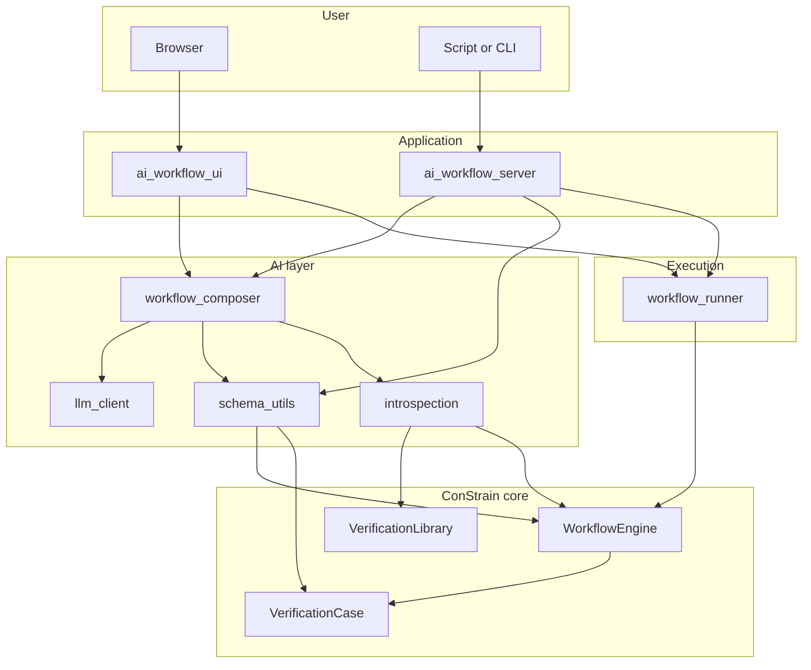

# AI Workflow Composer – Overview and Use Case

A short, high-level overview for users and stakeholders. Suitable for conversion to slides or a one-page brief.

---

## Slide 1: What is it?

**AI Workflow Composer** is an add-on to ConStrain that helps you create **workflow JSON** and **verification-case JSON** using natural language instead of editing JSON by hand.

- You describe what you want to verify (e.g. “G36 supply air temperature and damper behavior for my January dataset”).
- The system suggests valid workflow and case definitions.
- You can validate, edit, and run the workflow from a browser or via an API.

---

## Slide 2: Why use it?

| Without the composer | With the composer |
|----------------------|-------------------|
| Learn workflow schema and state types | Describe your goal in plain language |
| Look up API callables and parameters | System uses the real API and library to suggest valid steps |
| Manually wire states, Payloads, and Choices | Get a draft workflow and cases in one step |
| Fix validation errors by reading schema docs | See validation issues next to the proposed JSON |

**Use case:** Quickly go from “I have this dataset and these checks in mind” to a runnable ConStrain workflow and verification cases, then iterate.

---

## Slide 3: Scope at a glance

- **In:** Goal description, optional context (paths, signals).
- **Out:** Workflow JSON, verification-case JSON, validation feedback, optional execution.

---

## Slide 4: How you interact with it

**Option A – Web UI**

1. Start the UI server (`uv run uvicorn constrain.app.ai_workflow_ui:app --reload`).
2. Open the page, enter your goal (and optional context).
3. Click “Generate workflow & cases.”
4. Review the proposed JSON and validation; click “Run workflow” to execute.

**Option B – REST API**

- `POST /ai/workflow/suggest` and `POST /ai/cases/suggest` with a JSON body (goal, optional context).
- `POST /ai/workflow/execute` to run a workflow dict (e.g. from a previous suggest).
- Use from scripts, CI, or other tools.

**Option C – CLI after export**

- Save the suggested workflow and cases to files, then run with `Workflow(workflow="path/to/workflow.json").run_workflow()` (see user guide).

---

## Slide 5: End-to-end flow

- **Loop:** User can refine the goal or edit the JSON and regenerate or re-run.
- **Execution:** Runner fixes working directory so relative paths in the workflow resolve correctly; failures are logged with full traceback on the backend.

---

## Slide 6: What the system needs

- **Environment:** Python 3.10+, ConStrain installed (e.g. `uv pip install -e .`), plus FastAPI/Uvicorn/Jinja2 (in project dependencies).
- **LLM:** An OpenAI-compatible API (or compatible endpoint). Set `CONSTRAIN_LLM_API_BASE`, `CONSTRAIN_LLM_MODEL`, and optionally `CONSTRAIN_LLM_API_KEY`.
- **Data:** Your workflow’s paths (e.g. to CSV or case JSON) must be valid relative to the ConStrain package root when running (see user guide).

---

## Slide 7: Where to read more

| Document | Purpose |
|----------|---------|
| **Workflow_AI_User_Guide.md** | Setup, configuration, and step-by-step usage (UI, API, CLI). |
| **AI_Workflow_Composer_Design.md** | Design, architecture, components, data flows, and extension points. |
| **constrain/schema/workflow.schema.json** | Formal workflow JSON schema. |
| **Quickstart Guide.rst** | General ConStrain workflow and verification concepts. |

---

## One-page diagram: Component map

- **User** interacts via browser (UI) or script (API).
- **Application** routes to composer (suggest/validate) or runner (execute).
- **AI layer** uses LLM, schema validation, and introspection; **Execution** runs the workflow with correct cwd and logging.
- **ConStrain core** (engine, verification case, library) is unchanged except for import handling in the workflow engine.
