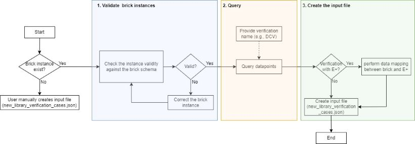
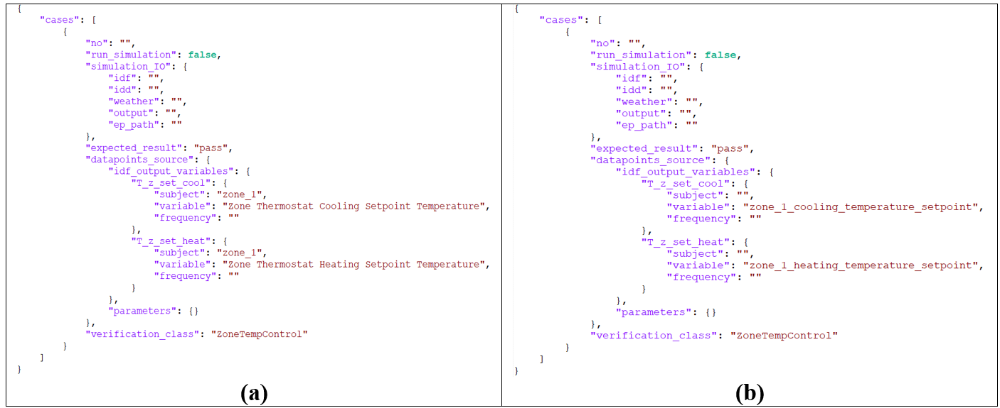
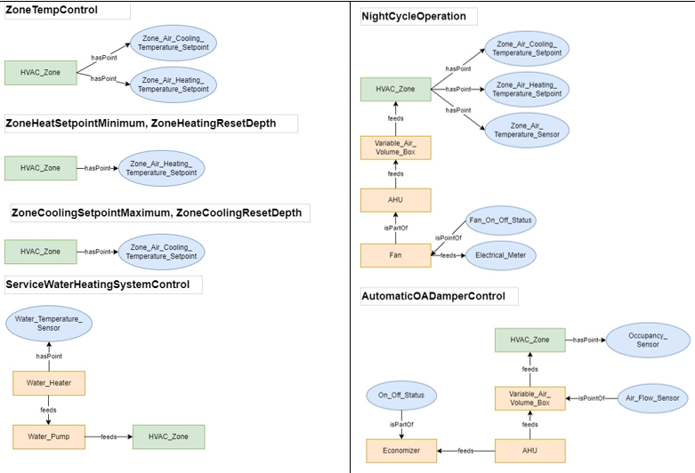
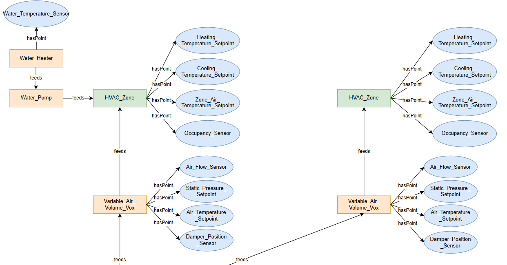
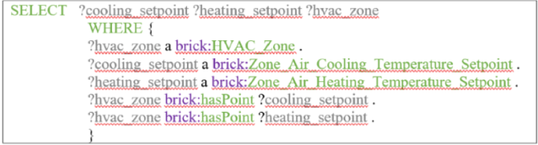
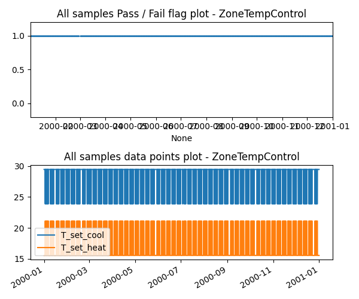

### Why ConStrain Integrates the Brick Schema?
The ConStrain team adopted the Brick Schema to automate the verification process. Buildings are complex entities where different systems—such as heating, cooling, air conditioning (HVAC), domestic hot water (DHW), lighting, and more—operate simultaneously. This complexity posed significant challenges to deploying the ConStrain application in real-world scenarios since users were required to manually identify relevant verification items and gather the associated data.
The Brick Schema addresses these challenges by providing a standardized framework for describing the physical, logical, and virtual systems within buildings. It utilizes a consistent ontology to define elements like sensors, equipment, zones, and their relationships. This standardization ensures seamless communication between systems within a building and allows for efficient querying and retrieval of building data.    


### Brick Compliance Features
To leverage the advantages of the brick schema, the ConStrain team developed three main brick compliance features, as illustrated in Figure 1.

Figure 1. Schematic Diagram of the Brick Compliance   

#### 1. Instance validation 
The first step in utilizing Brick compliance involves validating a Brick instance against the Brick Schema. This step ensures that the instance meets the schema's requirements. It is critical because an invalid instance can lead to incorrect class, object, or data property structures, which would disrupt subsequent processes such as querying data points. If the instance is deemed invalid, the user must correct it before proceeding to the querying phase. This feature corresponds to the `validate_brick_instance` method in the `BrickCompliance` class.

#### 2. Query Data Points
Once the instance is validated, the querying process begins. During this phase, pre-defined query statements are used to extract all the necessary data points for each verification item. Each verification item has a corresponding pre-defined query statement tailored to retrieve the required data points. This feature was implemented in the `query_verification_case_datapoints` and `query_with_customized_statement` methods in the `BrickCompliance` class. One example will be introduced in the brick demo section. 

#### 3. Create Input File
The final step is creating the input file, which varies depending on whether EnergyPlus simulation is utilized. If EnergyPlus is employed, an additional step—“perform data mapping between Brick and EnergyPlus”—is required. This process converts variable names from the Brick Schema into EnergyPlus-compatible names.
For instance, consider the ZoneTempControl verification item. The query output might be:
{"cooling_setpoint": "zone_1_cooling_temperature_setpoint", "heating_setpoint": "zone_1_heating_temperature_setpoint}.
Here, the keys represent variable names used in the SPARQL query process, and the values denote class names within the Brick instance.
Figure 2(a) displays the input file (`new_library_verification_cases.json`) generated when EnergyPlus mapping is performed, while Figure 2(b) shows the input file created without the mapping process. Notice the difference: in Figure 2(a), the variable names such as `1cooling_setpoint` and `heating_setpoint` are converted into EnergyPlus-standard names, like `Zone Thermostat Cooling Setpoint Temperature` and `Zone Thermostat Heating Setpoint Temperature`. Without the mapping process (Figure 2(b)), the variable names remain as they are in the Brick instance.
Once this step is completed, the generated input file serves as the foundation for control verification items. This feature doesn't have an explicit method but is embedded within the `query_verification_case_datapoints` and `query_with_customized_statement` methods in the `BrickCompliance` class. As a result, an input file is automatically created as soon as the query process is completed.    

Figure 2. (a) Input File with EnergyPlus Mapping Process (b) Inptu File without EnergyPlus Mapping Process  

#### 4. Find Applicable Verification Items
Although this feature is not explicitly depicted in Figure 1, applicable verification items can be automatically identified. The `get_applicable_verification_lib_items` method in the `BrickCompliance` class enables this functionality by checking whether the required class or object properties exist in the user-provided Brick instance for all available verification items. If the Brick instance contains the minimally required classes or objects, the associated verification item name will be returned through the execution of the `get_applicable_verification_lib_items method`. Figure 3 illustrates examples of minimum class/object property requirements.    

Figure 3. Examples of Minimum Class/Object Property Requirements   


### Brick Demo
To demonstrate the implementation of the Brick compliance features, the ConStrain team created a use-case scenario and developed `./constrain/demo/brick_demo`. In this demonstration, we assume a user has a Brick instance and applies it to a `ZoneTemperatureControl` verification item using the user's timeseries data.

The Brick instance used in the demo replicates a real building and provides a high-level representation of the building's HVAC and related infrastructure. It offers an organized model of zones, equipment, sensors, and setpoints. Key systems defined in the instance include Air Handling Units (AHU), Variable Air Volume (VAV) boxes, economizers, chillers, boilers, pumps, and cooling towers, along with their associated monitoring and control points and meters. The instance establishes connections between equipment and zones (e.g., zones served by VAV boxes connected to heating/cooling coils). It incorporates relationships such as `brick:feeds` and `brick:hasPoint` and includes sensors like temperature, airflow, and occupancy monitoring. Figure 4 shows snippet of the brick instance where relevant datapoints for the `ZoneTemperatureControl` are located. In the instance, there are two HVAC zones (`HVAC_Zone`) which include the `Heating_Temperature_Setpoint` and `Cooling_Temperature_Setpoint`.   

Figure 4. Snippet of the Brick Instance

The `brick_demo` first imports the Brick instance and schema and retrieves the necessary data points. In this demo, we assume the user performs the `ZoneTempControl` verification item automatically. To clarify, this verification item requires thermal zone-level heating and cooling setpoints. To provide these to the `ZoneTempControl` verification item, the pre-defined SPARQL query statement is utilized and the `ZoneTempControl` verification item's query statement is shown in Figure 5. This SPARQL query retrieves data related to HVAC zones and their associated temperature setpoints for cooling and heating. It specifies that the `?hvac_zone` is of type `brick:HVAC Zone`, while the `?cooling_setpoint` and `?heating_setpoint` are of types `brick:Zone_ Air_Cooling_Temperature_Setpoint` and `brick:Zone_Air_Heating_ Temperature_Setpoint`, respectively. Additionally, it enforces that each HVAC zone must be linked to these setpoints through the `brick:hasPoint` relationship.    
  
Figure 5. Pre-defined `ZoneTempControl` Verification item’s Query Statement   

With the queried datapoints, the verification item then checks whether the difference between cooling and heating setpoints is greater than 2.77 °C (equal to 5 °F). The pseudo-code, written in Python, can be outlined as follows:   
```python
if (temperature_air_zone_cool_setpoint - temperature_air_zone_heat_setpoint) > 2.77:  # 5°F = 2.77°C
    pass
else:
    fail
```

Below is a snippet of the query results. As shown, the required data points (`temperature_air_zone_cool_setpoint`, `temperature_air_zone_heat_setpoint`) were successfully queried with details on their associated subject and variable attributes:

```python
{
    "cases": [
        {
            "no": 1,
            "run_simulation": false,
            "simulation_IO": {
                "idf": "EnergyPlus_data",
                "idd": "",
                "weather": "",
                "output": "./demo/brick_demo/brick_dataset/data_file.csv",
                "ep_path": ""
            },
            "expected_result": "pass",
            "datapoints_source": {
                "dev_settings": {
                    "temperature_air_zone_cool_setpoint": {
                        "subject": "zone_1",
                        "variable": "zone_1_cooling_temperature_setpoint",
                        "frequency": ""
                    },
                    "temperature_air_zone_heat_setpoint": {
                        "subject": "zone_1",
                        "variable": "zone_1_heating_temperature_setpoint",
                        "frequency": ""
                    }
                },
                "parameters": {}
            },
            "verification_class": "ZoneTempControl"
        }
    ]
}
```

The figure below shows the outcome of the zone temperature control verification testing.   

The figure below illustrates the outcome of the `ZoneTemperatureControl` verification testing:    

Figure 6. `ZoneTemperatureControl` Testing Results

In the top figure, the y-axis value of 1.0 indicates a pass, while 0.0 indicates a fail. As observed, all verification tests pass because the heating and cooling setpoint differences exceed 2.77 °C at every timestep.    
In the bottom figure, the x-axis represents the year and month, while the y-axis represents temperatures in degrees Celsius. The blue graph displays cooling setpoints, while the orange graph shows heating setpoints. The heating setpoints fluctuate between 15.56 °C and 21.11 °C, while the cooling setpoints range between 23.89 °C and 29.22 °C.  

The Brick demo successfully showcases the implementation of Brick compliance features in automating building system verification. By leveraging a high-level Brick instance that models HVAC systems and infrastructure, the `ZoneTempControl` verification item was tested efficiently using real-time data. The results demonstrated that the heating and cooling setpoint differences consistently met the required threshold, verifying compliance across all timesteps. This highlights the potential of Brick Schema in streamlining building system validation and enabling precise and scalable automation for complex setups.   
